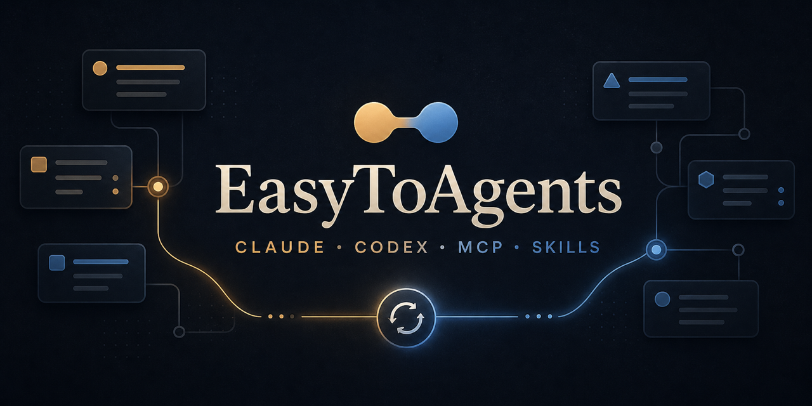
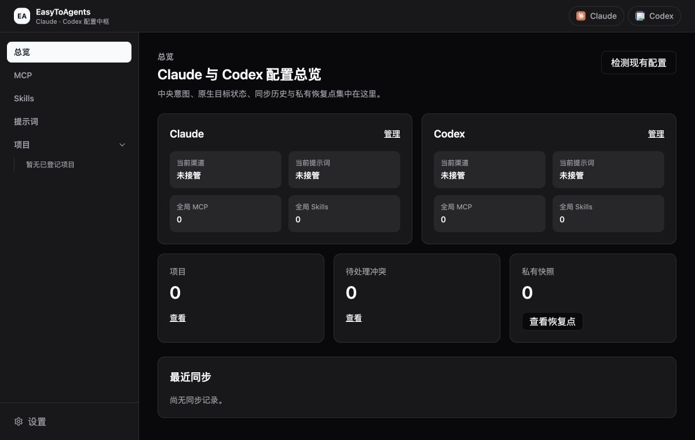

<p align="center">
  
</p>

<h1 align="center">EasyToAgents</h1>

<p align="center"><strong>把 Claude、Codex、Cursor、MCP、提示词与 Skills 收拢到一个可预览、可同步、可恢复的本地工作台。</strong></p>

<p align="center"><em>A local-first macOS app to preview, sync, and restore Claude, Codex, Cursor, MCP, prompts, and skills across projects.</em></p>

<p align="center">
  
  
  
  
  
</p>

<p align="center">
  <a href="#核心能力">核心能力</a> ·
  <a href="#产品实景">产品实景</a> ·
  <a href="#安全同步模型">安全同步</a> ·
  <a href="#快速开始">快速开始</a> ·
  <a href="#参与贡献">参与贡献</a>
</p>

EasyToAgents 面向同时使用 Claude、Codex 与 Cursor 的开发者。它把散落在工具全局目录和项目目录中的配置整理成中央意图，同时保留对原生目标状态的检查；默认先展示变更计划，再由用户确认是否写入磁盘。

- **中央意图**：在一个界面维护希望启用的 Provider、提示词、MCP 与 Skills。
- **原生目标**：继续使用 Claude、Codex、Cursor 各自公开支持的配置格式和目录，不引入专有运行时。
- **Local-first**：中央数据、同步记录与私有恢复点保留在本机，配置管理不依赖独立网站或云端控制台。

## 核心能力

| 能力                   | 可以做什么                                                                                   | 写入边界                                               |
| ---------------------- | -------------------------------------------------------------------------------------------- | ------------------------------------------------------ |
| **Providers / 提示词** | 检测并导入 Claude、Codex 的 Provider 与提示词；Provider 按工具启用，提示词可按工具或项目分配 | 中央档案的编辑与原生配置写入分离；默认先预览再确认应用 |
| **MCP**                | 在中央库维护 MCP Server，按 Claude、Codex、Cursor 或具体项目分配                             | 分配变化先更新中央意图，原生目标通过同步计划写入       |
| **Skills**             | 将 Skill 复制到中央目录，并通过受管符号链接同步到 Claude、Codex 与 Cursor 目标               | 应用前展示目标计划，应用后保留恢复快照                 |
| **Projects**           | 登记并只读扫描本地项目，在项目维度管理提示词、MCP 与 Skills                                  | 移除项目登记不会删除或改写已有原生配置                 |

Cursor 当前仅支持全局/项目 MCP 与 Skills；Provider、API Key、模型、Prompt 和项目级 Rules 均不受支持，也不会被读取或写入。总览页将中央意图、各工具原生目标状态、同步历史与恢复点放在同一处，便于判断“希望的配置”和“磁盘上的实际配置”是否一致。

## 产品实景

<p align="center">
  
</p>

<p align="center"><sub>总览界面 · 隔离空数据状态，不包含个人配置或项目路径</sub></p>

## 安全同步模型

1. **只读检测**：各类配置在接管前先扫描 Claude、Codex、Cursor 或已登记项目中的受支持状态，不立即写入。
2. **选择性接管**：只把明确选择的 Provider、提示词、MCP 或 Skill 纳入中央管理。
3. **变更预览**：生成将要创建、更新或移除的目标计划，展示警告、冲突和脱敏差异。
4. **确认应用**：默认仅在确认后写入原生目标，并保留不属于 EasyToAgents 管理的内容。
5. **快照恢复**：成功应用会产生私有恢复点，可从同步历史回到先前状态。

> 设置中也提供跳过确认对话框的直接应用模式；它仍会先生成预览，并且只会自动应用无冲突、无错误且目标未受阻的计划。默认模式始终是“预览并确认”。

## 快速开始

当前支持 **macOS 13+**。仓库尚未提供公开 Release 或预编译安装包，需要从源码运行。

### 环境要求

- Node.js 与 pnpm 10（仓库当前声明 `pnpm@10.13.1`）
- Rust 1.77.2 或更高版本
- Tauri 2 在 macOS 上所需的系统开发环境

### 从源码运行

```bash
git clone https://github.com/zhexin233-ui/easytoagents.git
cd easytoagents
pnpm install
pnpm tauri dev
```

`pnpm tauri dev` 会同时启动 Vite 前端与 Tauri 桌面窗口。

只调试界面时可以运行 `pnpm dev`；涉及配置检测、导入、预览、应用或恢复的功能仍需在 Tauri 窗口中使用。

### 本地构建

```bash
pnpm tauri build
```

项目的 Tauri 配置会在 macOS 本地构建 `.app` 与 `.dmg`。

## 首次使用

1. 从总览点击 **开始首次检测**，只读发现本机已有的 Claude 与 Codex 的 Provider 和全局提示词；Cursor 的 MCP/Skills 从对应资源页导入。
2. 按工具选择要导入的 Provider 或提示词；不希望接管的内容可以直接跳过。
3. 在中央库中补充 MCP、Skills，并按全局或项目范围分配。
4. 生成同步预览，检查目标路径、变更类型、警告、冲突和脱敏差异。
5. 确认应用；需要回退时，从总览的私有快照入口预览并执行恢复。

## 开发

### 常用命令

| 命令                  | 用途                                |
| --------------------- | ----------------------------------- |
| `pnpm dev`            | 启动 Vite 开发服务器                |
| `pnpm tauri dev`      | 以开发模式启动桌面应用              |
| `pnpm tauri build`    | 构建 macOS `.app` 与 `.dmg`         |
| `pnpm build`          | 执行 TypeScript 检查并构建前端      |
| `pnpm test --run`     | 单次运行 Vitest 测试                |
| `pnpm lint`           | 运行 ESLint                         |
| `pnpm typecheck`      | 运行 TypeScript 类型检查            |
| `pnpm bindings:check` | 检查 Rust → TypeScript 绑定是否最新 |
| `pnpm rust:check`     | 检查 Rust 格式、Clippy 与测试       |
| `pnpm check`          | 运行项目完整质量检查                |

### 技术栈

| 层级       | 技术                                              |
| ---------- | ------------------------------------------------- |
| 桌面端     | Tauri 2、Rust、SQLite（rusqlite）                 |
| 界面层     | React 19、TypeScript 6、React Router 7            |
| 状态与数据 | TanStack Query 5                                  |
| 构建与样式 | Vite 8、Tailwind CSS 4                            |
| 测试与质量 | Vitest、Testing Library、ESLint、Prettier、Clippy |

## 当前范围

- 仅支持 macOS 13+；其他桌面平台尚未纳入当前支持范围。
- 当前以源码运行和本地构建为主，没有公开 Release、预编译下载页或独立官网。
- 仓库目前未提供 `LICENSE` 文件。
- README 只描述仓库中已经实现且可验证的配置管理流程，不代表所有第三方工具配置都已覆盖。

## 参与贡献

欢迎通过 [Issues](https://github.com/zhexin233-ui/easytoagents/issues) 报告问题或讨论改进，也欢迎提交 [Pull Requests](https://github.com/zhexin233-ui/easytoagents/pulls)。开始修改前，请先说明变更范围；提交前运行：

接入新的工具前，请先阅读[《接入新的工具 Adapter》](docs/maintainers/adding-tool-adapter.md)，从官方证据和 capability matrix 开始，未知能力必须 fail closed。

```bash
pnpm check
git diff --check
```
